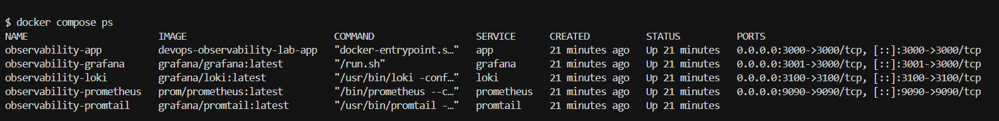
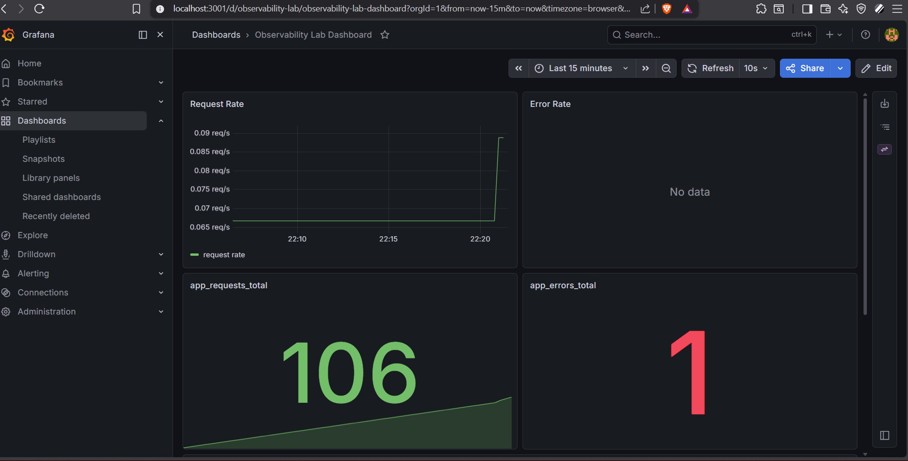
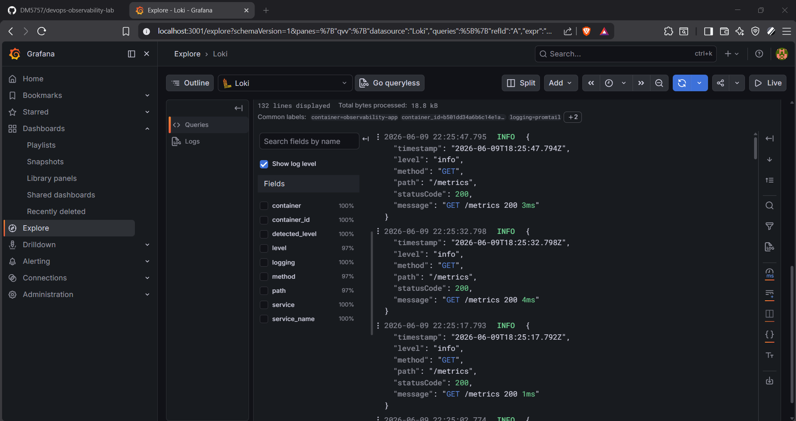
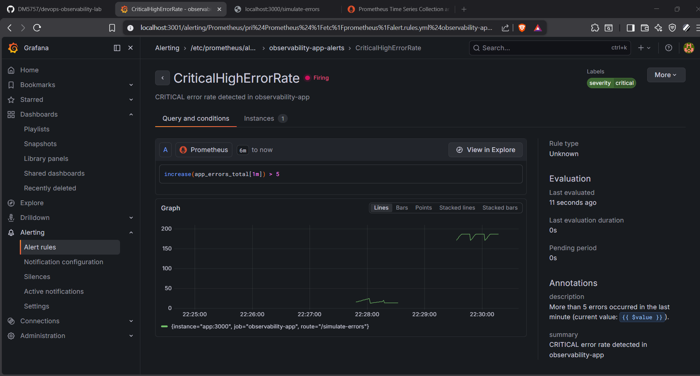
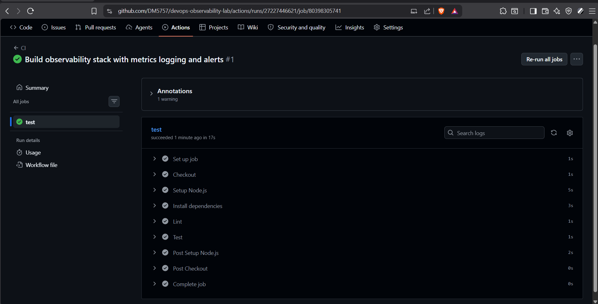

# DevOps Observability Lab

A hands-on lab for learning observability with a real Docker Compose stack. A small Node.js app exposes metrics and structured logs; Prometheus, Grafana, Loki, and Promtail collect and visualize them.

## Tech Stack

- **App:** Node.js, Express, prom-client
- **Metrics:** Prometheus
- **Dashboards & alerts:** Grafana
- **Logs:** Loki + Promtail
- **Orchestration:** Docker Compose
- **CI:** GitHub Actions

## Architecture


**How it fits together:**

1. The Express app writes one JSON log line per request to stdout.
2. Docker captures container stdout; Promtail reads those logs and ships them to Loki.
3. Prometheus scrapes `/metrics` from the app every 15 seconds.
4. Grafana connects to both Prometheus and Loki and loads a pre-built dashboard.

## Getting Started

### Prerequisites

- [Docker Desktop](https://www.docker.com/products/docker-desktop/) (or Docker Engine + Compose)
- Node.js 20+ (for local development and tests)

### Start the full stack

From the project root:

```bash
docker compose up --build
```

Wait until all five services are running. The app rebuilds on first start.

### Service URLs

| Service    | URL                          |
|------------|------------------------------|
| App        | http://localhost:3000        |
| Prometheus | http://localhost:9090        |
| Grafana    | http://localhost:3001        |
| Loki       | http://localhost:3100        |

**Grafana login:** `admin` / `admin`

### Try it out

1. Open http://localhost:3000 — browse the endpoints listed on the home page.
2. Open Grafana → **Observability Lab Dashboard** — watch request and error metrics update.
3. Trigger the **CRITICAL** alert (see below).

### Trigger the CRITICAL alert

1. Visit http://localhost:3000/simulate-errors — this increments `app_errors_total` by 10 in under a second.
2. Open Prometheus → **Alerts** → confirm `CriticalHighErrorRate` is **Firing**.
3. Open Grafana → **Alerting** or the dashboard error-rate panel to see the spike.

The alert rule is defined in `prometheus/alert.rules.yml`:

```yaml
- alert: CriticalHighErrorRate
  expr: increase(app_errors_total[1m]) > 5
  labels:
    severity: critical
  annotations:
    summary: "CRITICAL error rate detected in observability-app"
```

See the [Alert Rule Evidence](#alert-rule-evidence) section below for a screenshot.

### Local development (without Docker)

```bash
npm install
npm start        # runs on http://localhost:3000
npm test         # Jest + Supertest
npm run lint     # ESLint
```

## Logging Strategy

Every HTTP request produces exactly one JSON log line on stdout. Errors from `/error` and `/simulate-errors` also emit separate log lines with `"level": "error"`.

Docker stores container stdout. Promtail discovers containers via the Docker socket, reads their log files, parses JSON fields, and pushes labeled log streams to Loki. In Grafana you can filter by `service="observability-app"` or by log level.

### JSON log format

Each line is a single JSON object:

```json
{
  "timestamp": "2026-06-09T12:00:00.000Z",
  "level": "info",
  "method": "GET",
  "path": "/health",
  "statusCode": 200,
  "message": "GET /health 200 2ms"
}
```

This format is easy to parse, search in Loki, and ship to other tools without custom regex.

## Metrics vs Logs

| | Prometheus (metrics) | Loki (logs) |
|---|---------------------|-------------|
| **What** | Aggregated counters and rates | Individual event records |
| **Example** | `app_errors_total`, request rate | Full error message with timestamp |
| **Best for** | Dashboards, alerts, trends | Debugging specific requests |
| **Retention** | Short-to-medium (time-series) | Configurable text retention |

Use **metrics** to know *that* something is wrong. Use **logs** to understand *why*.

## Long-Term Log Retention

Loki is configured with a **7-day retention period** (`168h` in `loki/loki-config.yml`). The compactor runs periodically and deletes chunks older than that.

For production you would typically:

- Increase retention based on compliance needs
- Move old logs to object storage (S3, GCS)
- Use Grafana Cloud or a managed Loki instance for scale

Prometheus metrics retention is separate (default ~15 days in Prometheus itself) and tuned for operational alerting, not audit history.

## Project Layout

```
app/server.js              Express app with metrics and logging
tests/app.test.js          API tests
prometheus/                Prometheus scrape config and alert rules
loki/                      Loki storage and retention config
promtail/                  Log shipping from Docker containers
grafana/                   Datasources, dashboard provisioning
docker-compose.yml         Full observability stack
.github/workflows/ci.yml   Lint and test on push/PR
```

## Evidence

### Docker Compose deployment

All five services running after `docker compose up --build`:

[](screenshots/docker-compose-running.png)

### Grafana dashboard

Request rate, error rate, and counter panels from the pre-provisioned **Observability Lab Dashboard**:

[](screenshots/grafana-dashboard.png)

### Log analysis

Application JSON logs in Grafana, filtered via Loki (`service="observability-app"`). Each line includes `timestamp`, `level`, `method`, `path`, `statusCode`, and `message`:

[](screenshots/grafana-logs.png)

### Alert rule evidence

`CriticalHighErrorRate` firing in Prometheus/Grafana after visiting `/simulate-errors`:

[](screenshots/grafana-alert.png)

### CI pipeline

GitHub Actions workflow passing lint and tests on push/PR:

[](screenshots/ci-success.png)

## Analysis Questions

**1. Why use Prometheus metrics and Loki logs together instead of only one?**

Metrics are aggregated and cheap to query over time — ideal for dashboards and alerts (e.g. error rate spiking). Logs capture individual events with full context — ideal for debugging a specific failed request. Together they answer *what* is wrong (metrics) and *why* (logs).

**2. Why log in JSON instead of plain text?**

JSON is structured and machine-parseable. Promtail can extract fields (`level`, `path`, `statusCode`) as Loki labels without fragile regex. Log aggregation tools can filter and search consistently across services.

**3. What happens when you hit `/simulate-errors`?**

The app increments `app_errors_total` ten times and writes ten error-level JSON log lines. Prometheus scrapes the updated counter; within one minute `increase(app_errors_total[1m])` exceeds 5 and `CriticalHighErrorRate` fires with severity `critical`.

**4. How would you extend this lab for production?**

Add Alertmanager for notifications (Slack, PagerDuty), secure Grafana with SSO, run Prometheus/Loki with persistent volumes and longer retention, ship logs to object storage, and add RED/USE dashboards plus SLO-based alerts.

**5. What is the difference between short-term metrics retention and long-term log retention here?**

Prometheus keeps time-series samples for operational alerting (~15 days by default). Loki is configured for 7-day log retention in `loki/loki-config.yml`. Metrics tell you trends; logs provide an audit trail for investigation within the retention window.

## License

MIT
