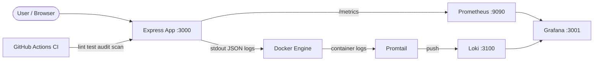
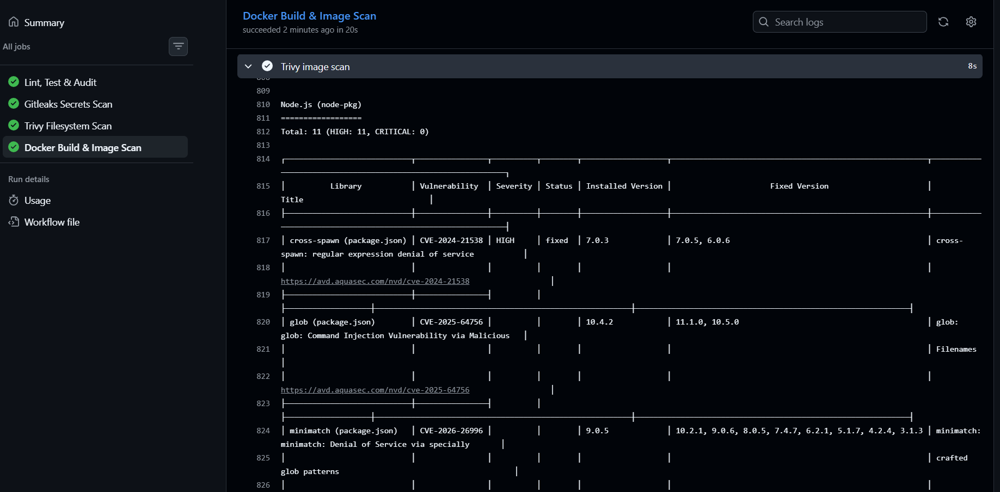
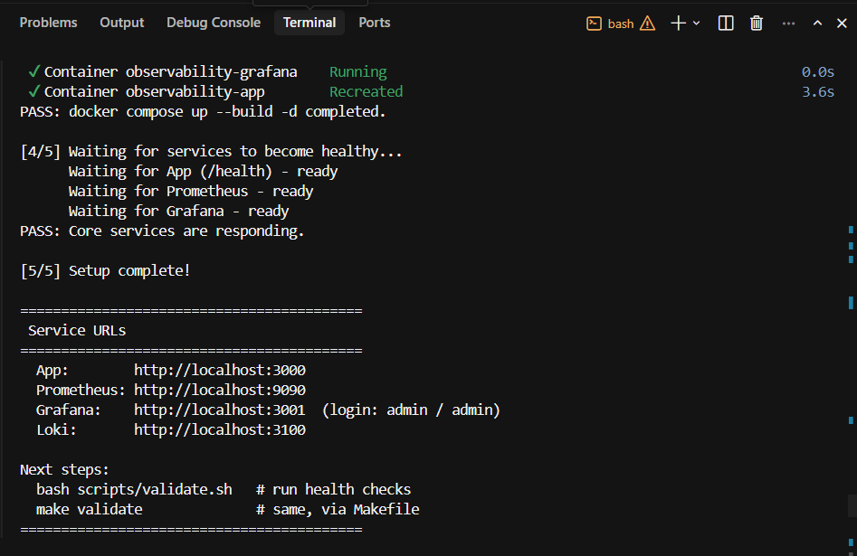
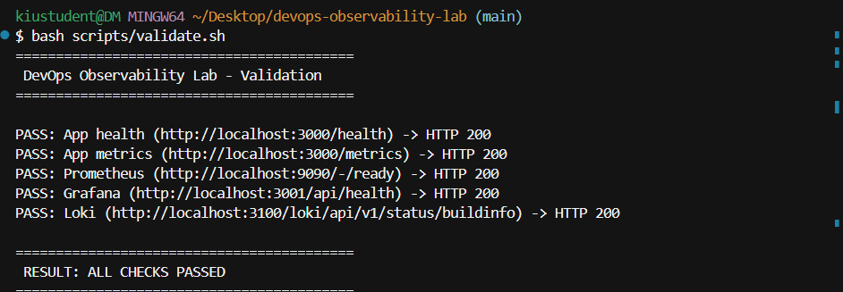
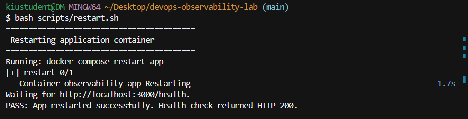

# DevOps Observability Lab

A hands-on lab for learning observability, security automation, and reliability with a real Docker Compose stack. A small Node.js app exposes metrics and structured logs; Prometheus, Grafana, Loki, and Promtail collect and visualize them. Shell scripts and a Makefile automate setup, validation, and recovery.

## Tech Stack

- **App:** Node.js, Express, prom-client, Helmet
- **Metrics:** Prometheus
- **Dashboards & alerts:** Grafana
- **Logs:** Loki + Promtail
- **Orchestration:** Docker Compose
- **CI & security:** GitHub Actions, npm audit, Gitleaks, Trivy
- **Automation:** Bash scripts, Makefile

## Project Architecture



**How it fits together:**

1. The Express app writes one JSON log line per request to stdout and exposes Prometheus metrics at `/metrics`.
2. Docker captures container stdout; Promtail reads those logs and ships them to Loki.
3. Prometheus scrapes `/metrics` from the app every 15 seconds and evaluates alert rules.
4. Grafana connects to both Prometheus and Loki and loads a pre-built dashboard.
5. CI runs lint, tests, dependency audit, secrets scan, and Trivy vulnerability scans on every push.

## Deployment Workflow

```
Developer change
      │
      ▼
Git push / pull request
      │
      ▼
GitHub Actions CI
  ├── lint + test
  ├── npm audit (high/critical)
  ├── Gitleaks secrets scan
  ├── Trivy filesystem scan
  └── Docker build + Trivy image scan
      │
      ▼
Local deploy: bash scripts/setup.sh
      │
      ▼
bash scripts/validate.sh  →  all PASS
      │
      ▼
Demo / testing with Grafana + Prometheus
```

## Environment Setup

### Prerequisites

- [Docker Desktop](https://www.docker.com/products/docker-desktop/) (or Docker Engine + Compose)
- Node.js 20+ (for local development and tests)
- Git Bash (Windows) or any bash shell (Linux/macOS)

### One-command setup

From the project root:

```bash
bash scripts/setup.sh
```

Or with Make:

```bash
make setup
```

The setup script checks Docker, starts the full stack with `docker compose up --build -d`, waits for the app, Prometheus, and Grafana to be ready, then prints service URLs.

### Docker Compose local execution

You can also start manually:

```bash
docker compose up --build -d    # detached
docker compose up --build       # foreground with logs
docker compose down             # stop all services
```

Validate after startup:

```bash
bash scripts/validate.sh
# or: make validate
```

### Service URLs

| Service    | URL                          |
|------------|------------------------------|
| App        | http://localhost:3000        |
| Prometheus | http://localhost:9090        |
| Grafana    | http://localhost:3001        |
| Loki       | http://localhost:3100        |

**Grafana login:** `admin` / `admin`

### Makefile commands

| Command | Action |
|---------|--------|
| `make setup` | Run `scripts/setup.sh` |
| `make start` | `docker compose up --build -d` |
| `make stop` | `docker compose down` |
| `make restart` | Restart app container only |
| `make validate` | Run health checks |
| `make test` | `npm test` |
| `make lint` | `npm run lint` |
| `make security` | `npm audit --audit-level=high` |
| `make logs` | Follow app container logs |

Scripts work without Make — the Makefile is a convenience wrapper.

### Local development (without Docker)

```bash
npm install
npm start        # runs on http://localhost:3000
npm test         # Jest + Supertest
npm run lint     # ESLint
```

## Security Implementation

Security is automated in CI and reinforced in the application.

### npm audit

Scans `package-lock.json` for known dependency vulnerabilities. CI fails only on **high** and **critical** issues (`npm audit --audit-level=high`). Low and medium findings are reported but do not block the pipeline.

### Gitleaks secrets scanning

[Gitleaks](https://github.com/gitleaks/gitleaks) scans the full Git history for accidentally committed secrets (API keys, passwords, tokens). Runs on every push and pull request via `gitleaks/gitleaks-action`.

### Trivy filesystem scan

[Trivy](https://github.com/aquasecurity/trivy) scans project files (configs, dependencies, IaC) for **HIGH** and **CRITICAL** vulnerabilities before anything is containerized.

### Trivy Docker image scan

After `docker build`, Trivy scans the built image for OS and application-layer vulnerabilities at **HIGH** and **CRITICAL** severity. This catches issues introduced by the base image (`node:20-alpine`) as well as installed packages.

### Application security headers

The Express app uses [Helmet](https://helmetjs.github.io/) to set security headers (`X-Content-Type-Options`, `X-Frame-Options`, etc.). Content Security Policy is disabled so the demo HTML page keeps its inline styles.

### Security checks in CI

The workflow (`.github/workflows/ci.yml`) runs four jobs:

1. **Lint, Test & Audit** — `npm ci`, lint, test, npm audit
2. **Gitleaks Secrets Scan** — secret detection
3. **Trivy Filesystem Scan** — config/code vulnerabilities
4. **Docker Build & Image Scan** — container image vulnerabilities

## Reliability Improvements

### Health checks

`GET /health` returns `{"status":"ok","service":"observability-lab"}`. Used by `scripts/validate.sh`, `scripts/restart.sh`, and `scripts/setup.sh` to confirm the app is alive.

### validate.sh

Runs five HTTP checks (app health, app metrics, Prometheus, Grafana, Loki) and prints PASS/FAIL for each. Exits with code 1 if any check fails — suitable for scripting and post-deploy verification.

### restart.sh

Restarts only the `app` container (`docker compose restart app`) without touching Prometheus, Grafana, Loki, or Promtail. Waits for `/health` to return OK before reporting success.

### rollback.sh

A safe rollback guide for local Docker Compose deployments. Prints manual steps to checkout a stable Git commit and rebuild. Does **not** modify files automatically. Pass a commit hash for ready-made commands:

```bash
bash scripts/rollback.sh abc1234
```

### incident-response.md

See [`docs/incident-response.md`](docs/incident-response.md) for a step-by-step guide covering unhealthy apps, container inspection, Prometheus targets, Grafana dashboards, Loki logs, restart, and rollback.

**Service availability objective:** 99% local availability during demo/testing, monitored via `/health` and Prometheus scrape interval (15s).

### Prometheus alerting

`CriticalHighErrorRate` fires when `increase(app_errors_total[1m]) > 5`. Trigger it with http://localhost:3000/simulate-errors.

## Monitoring and Logging Overview

| Signal | Tool | Source | Use case |
|--------|------|--------|----------|
| Metrics | Prometheus | `GET /metrics` | Request/error rates, alerting |
| Logs | Loki via Promtail | App stdout (JSON) | Debugging individual requests |
| Dashboards | Grafana | Prometheus + Loki | Visual overview |
| Alerts | Prometheus rules | `app_errors_total` | Critical error rate detection |

### Logging strategy

Every HTTP request produces one JSON log line on stdout. Errors from `/error` and `/simulate-errors` also emit separate log lines with `"level": "error"`.

Docker stores container stdout. Promtail discovers containers via the Docker socket, parses JSON fields, and pushes labeled streams to Loki. Filter in Grafana with `{service="observability-app"}`.

### JSON log format

```json
{
  "timestamp": "2026-06-09T12:00:00.000Z",
  "level": "info",
  "method": "GET",
  "path": "/health",
  "statusCode": 200,
  "message": "GET /health 200 2ms"
}
```

### Metrics vs logs

| | Prometheus (metrics) | Loki (logs) |
|---|---------------------|-------------|
| **What** | Aggregated counters and rates | Individual event records |
| **Example** | `app_errors_total`, request rate | Full error message with timestamp |
| **Best for** | Dashboards, alerts, trends | Debugging specific requests |
| **Retention** | Short-to-medium (time-series) | 7 days (configured in Loki) |

Use **metrics** to know *that* something is wrong. Use **logs** to understand *why*.

## Alerting Strategy

1. **Rule:** `CriticalHighErrorRate` in `prometheus/alert.rules.yml`
2. **Condition:** `increase(app_errors_total[1m]) > 5`
3. **Severity:** `critical`
4. **Trigger:** Visit http://localhost:3000/simulate-errors (10 errors at once)
5. **Verify:** Prometheus → Alerts, or Grafana → Alerting

```yaml
- alert: CriticalHighErrorRate
  expr: increase(app_errors_total[1m]) > 5
  labels:
    severity: critical
  annotations:
    summary: "CRITICAL error rate detected in observability-app"
```

## Try it out

1. Open http://localhost:3000 — browse the endpoints listed on the home page.
2. Open Grafana → **Observability Lab Dashboard** — watch request and error metrics update.
3. Trigger the **CRITICAL** alert:
   - Visit http://localhost:3000/simulate-errors
   - Open Prometheus → **Alerts** → confirm `CriticalHighErrorRate` is **Firing**
   - Check Grafana → **Alerting** or the dashboard error-rate panel

## Project Layout

```
app/server.js                 Express app with metrics, logging, Helmet
tests/app.test.js             API tests
scripts/
  setup.sh                    One-command environment setup
  validate.sh                 Health check all services
  restart.sh                  Restart app container only
  rollback.sh                   Safe rollback instructions
docs/incident-response.md     Incident response playbook
prometheus/                   Scrape config and alert rules
loki/                         Loki storage and retention config
promtail/                     Log shipping from Docker containers
grafana/                      Datasources, dashboard provisioning
docker-compose.yml            Full observability stack
Makefile                      Convenience commands
.github/workflows/ci.yml      Lint, test, audit, and security scans
```

## Evidence

### 1. CI/CD and Security

**CI Success** — GitHub Actions workflow passing lint, tests, audit, and security scans:

[](screenshots/ci-success.png)

**Trivy Image Scan** — HIGH/CRITICAL vulnerabilities reported in the Docker image scan job:

[](screenshots/trivy-scan.png)

### 2. Environment Automation

**Setup Script** — one-command stack startup with `bash scripts/setup.sh`:

[](screenshots/setup-script.png)

**Validation Script** — health checks for all services with PASS/FAIL output:

[](screenshots/validate-script.png)

**Restart Script** — app container restart with health check confirmation:

[](screenshots/restart-script.png)

**Docker Compose Running** — all five services up after `docker compose up --build`:

[](screenshots/docker-compose-running.png)

### 3. Observability

**Grafana Dashboard** — request rate, error rate, and counter panels:

[](screenshots/grafana-dashboard.png)

**Grafana Logs** — structured JSON application logs via Loki:

[](screenshots/grafana-logs.png)

**Grafana Alert** — `CriticalHighErrorRate` firing after `/simulate-errors`:

[](screenshots/grafana-alert.png)

## Analysis Questions

**1. Why use Prometheus metrics and Loki logs together instead of only one?**

Metrics are aggregated and cheap to query over time — ideal for dashboards and alerts. Logs capture individual events with full context — ideal for debugging. Together they answer *what* is wrong (metrics) and *why* (logs).

**2. Why log in JSON instead of plain text?**

JSON is structured and machine-parseable. Promtail can extract fields (`level`, `path`, `statusCode`) as Loki labels without fragile regex.

**3. What happens when you hit `/simulate-errors`?**

The app increments `app_errors_total` ten times and writes ten error-level JSON log lines. Within one minute `increase(app_errors_total[1m])` exceeds 5 and `CriticalHighErrorRate` fires.

**4. How would you extend this lab for production?**

Add Alertmanager for notifications, secure Grafana with SSO, persistent volumes, longer retention, and SLO-based alerts. The scripts and incident-response guide provide a foundation for operational runbooks.

**5. What is the difference between short-term metrics retention and long-term log retention here?**

Prometheus keeps time-series samples for operational alerting (~15 days by default). Loki is configured for 7-day log retention in `loki/loki-config.yml`.

## License

MIT
